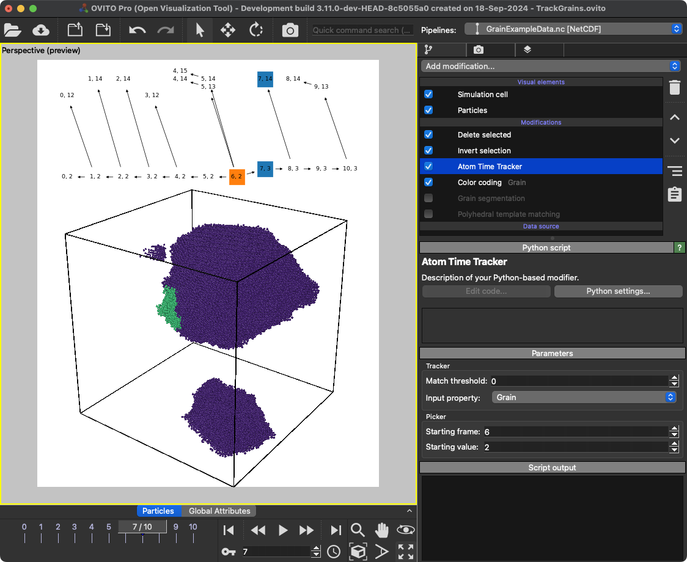

# Atom Time Tracker 
Track grains,clusters, etc. over time

## Description
This modifier is currently in early beta / under development. It might not work for your data. If you encounter any issues or have suggestions, please feel free to open an issue or contact me via email.

Additional information can be found in this [matsci discussion](https://matsci.org/t/how-to-track-grain-size-of-a-grain-across-timesteps/57924/2?u=utt).

## Parameters 
[[Function parameters]]

## Example
Examples can be found in "examples/"



## Installation
- OVITO Pro [integrated Python interpreter](https://docs.ovito.org/python/introduction/installation.html#ovito-pro-integrated-interpreter):
  ```
  ovitos -m pip install --user git+https://github.com/ovito-org/AtomTimeTracker.git
  ``` 
  The `--user` option is recommended and [installs the package in the user's site directory](https://pip.pypa.io/en/stable/user_guide/#user-installs).

- Other Python interpreters or Conda environments:
  ```
  pip install git+https://github.com/ovito-org/AtomTimeTracker.git
  ```

## Technical information / dependencies
- Tested on OVITO version 3.11.0 (currently in development and available from https://www.ovito.org/development_builds/)

## Contact
Daniel Utt utt@ovito.org